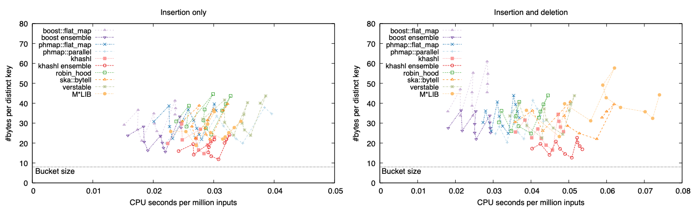

## Introduction

This is the third version of Unordered Dictionary Benchmark (udb3). It
evaluates the performance of several popular hash table libraries in C or C++.

### The design of the benchmark

There are two tasks. **The first focuses on insertion only**. We insert 80
million 32-bit integers, with duplicates, to the hash table and counts the
occurrence of each distinct key. There are 16.6 million entries left in the
table in the end. **The second task evaluates both insertions and deletions**.
The input is the same 80 million integers. We insert an integer to the hash
table if it is not in the table already, or delete it if present. There are 9.2
million integers left in the table. For both tasks, we record CPU time and peak
memory at 11 checkpoints, reports the average CPU time per million inputs and
the average memory per entry in the table, and plot them.

### The rationale behind the design

A hash table library can usually be made faster by lowering its default [load
factor][lf] threshold but this comes at a cost of memory. Controlling the
threshold would not give us a complete picture, either, because the optimal
threshold of a library depends on its implementation details and even at the
same load factor threshold, some libraries may use more auxiliary data than
others and thus take more memory. In this benchmark, we **measure speed and
memory at the same time**. If library *A* is faster and uses less memory than
*B*, *A* will be better no matter how we tune the load factor of *B*. If *A* is
faster but uses more memory, we cannot draw a firm conclusion but at least we
will see the speed-memory tradeoff of a library.

### Ensemble of hash tables

A hash table can be implemented with an ensemble of smaller hash tables.
Suppose there are `n` sub-tables. A key `x` is located in sub-table `hash(x) %
n`. Because it is rare for all sub-tables rehash at the same time, the peak
memory can be reduced. You can find more explanation in [this blog][ensemble].
In my opinion, **the best strategy for huge hash tables is to use an ensemble
of hash tables**.

We can implement a hash table ensemble in the user space for any libraries. I
have been using the idea since 2015. Nonetheless, it is more convenient to
hide the details behind the library code such that users can use familiar hash
table APIs. [phmap][phmap] is perhaps the first library to do this. I have
recently integrated the ensemble idea into my [khashl.h][khashl] as well.

## Results

The following figure shows the results measured on an M1 MacBook Pro in
December, 2023. Roughly speaking, a hash table library is represented by a
cloud of points. The relative positions of clouds inform their performance.

In the figure, `boost ensemble`, which implements an ensemble of hash tables in
the user code, is the fastest library using comparable memory to others. It is
the clear winner in this benchmark. `khashl ensemble` uses the least amount of
memory perhaps because it uses `realloc` and only doubles the memory during
rehashing; other libraries need to triple the memory.

Among the implementations without ensembles
[`boost::unordered_flat_map`][boost] is the fastest though it uses a lot more
memory on the deletion workload. Built on top of [`absl::flat_hash_map`][absl],
[`phmap::flat_hash_map`][phmap] is impressive on performance.
[`robin_hood::unordered_map`][rh] is a good choice if you need a small, fast and
portable hash table library. [`ska::bytell_hash_map`][ska] is a worthy mention
even though it has not been updated since 2018.

Among hash table libraries in C, [verstable][vt] is fast, light and convenient
to use. It easily gets a recommendation from me. [M\*LIB][mlib] is fast on
insertion but does not perform well on deletion. I developed [khashl][khashl].

### On other hash table libraries

The figure above focuses on high-performance hash table libraries. The figure
below shows several other popular libraries.

We can see that `std::unordered_map` and [uthash][uthash] are times slower and
use more memory. They should be avoided if hash table operations are a
bottlebeck. The developer of robin-hood-hashing now recommends
[`ankerl::unordered_dense`][ud]. However, this new library does not perform
well on this benchmark. In addition, its relative performance to
robin-hood-hashing also varies greatly, from 20% slower to >100% slower, on
different CPUs I have access to. If you want to use unordered\_dense in your
production code, I recommend to compare it to other libraries on your specific
applications.

## Concluding remarks

This benchmark only evaluates small key-value pairs because I only use small
keys in huge hash tables. The performance of large key-value pairs may be
different. In addition, this benchmark mixes different hash table operations
including insertion of new entries, query of existing entries and deletions.
Depending on the frequency of each type of operation, the results may look
different, too. Hash table evaluation is complicated. Developers interested in
hash table performances are recommended to read other benchmarks as well.

[lf]: https://en.wikipedia.org/wiki/Hash_table#Load_factor
[ensemble]: https://greg7mdp.github.io/parallel-hashmap/
[phmap]: https://github.com/greg7mdp/parallel-hashmap
[khashl]: https://github.com/attractivechaos/klib/blob/master/khashl.h
[boost]: http://bannalia.blogspot.com/2022/11/inside-boostunorderedflatmap.html
[absl]: https://abseil.io/docs/cpp/guides/container
[rh]: https://github.com/martinus/robin-hood-hashing
[ud]: https://github.com/martinus/unordered_dense
[ska]: https://github.com/skarupke/flat_hash_map
[vt]: https://github.com/JacksonAllan/Verstable
[mlib]: https://github.com/P-p-H-d/mlib
[uthash]: https://troydhanson.github.io/uthash/
